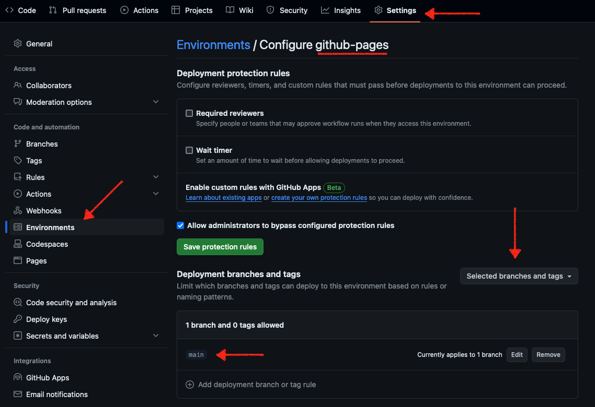

# Portafolio "perfecto" para programadores

## Publicar en GitHub Pages

### Crear un environment 

Estas son las instrucciones para crear un environment llamado `github-pages`:

1. Navega a las Settings de tu repositorio.
2. Abre `Environments` en la sección `Code and automation`.
3. Presiona el botón `New environment`.
4. En el nombre ingresa `github-pages`.
5. En la sección `Deployment branches and tags`, click en el menú que dice `No restricion`.
6. Del menú desplegable, seleccionar `Selected branches and tags`.
7. Un nuevo panel debió haber aparecido, click en `Add deployment branch or tag rule`.
8. Escribe el nombre de tu rama principal, generalmente `main`.
9. Haz click en `Add rule`.

Debe quedar algo así:

### Publicar

Para publicar nuevas versiones de tu portafolio, debes hacerlo con la acción `🚀 Publicar GitHub Pages`.

1. Navega a `Actions`.
2. Selecciona `🚀 Publicar GitHub Pages`
3. Click en `Run workflow`
4. Ten en cuenta que solo funciona desde la rama `main`.
5. Click en `Run workflow`.

## Actualizar datos personales

### Datos de la página

Abrir el archivo `./assets/data/data.json`.

Inspeccionarlo y colocar los datos según creas correcto.

Alternativamente, puedes usar como base el archivo de plantilla `data_template.json`.

IMPORTANTE: el archivo que quieras usar se debe llamar `data.json`. Si decides usar la plantilla base, recuerda renombrarla.

## Plantilla de portafolio web minimalista configurable a nivel gráfico y de contenido.

Desarrollado utilizando [Python](https://python.org) y [Reflex](https://reflex.dev), disponible para desplegar de forma estática (HTML, CSS, JS).

#### Proyecto realizado durante emisiones en directo desde [Twitch](https://twitch.tv/mouredev)
> ##### Si consideras útil el proyecto, apóyalo haciendo "★ Star" en el repositorio. ¡Gracias!

## Portafolio

¿Qué información debo añadir en mi portafolio como desarrollador? En [este](https://youtu.be/zFbTXe1yFGA) vídeo explico el por qué de cada apartado.

Tras el análisis, elaboré un esquema para reflejar la información obligatoria, recomendable, opcional y desaconsejada de la web.

Con esta premisa he desarrollado este proyecto web que refleja de manera real toda la información de nuestro "portafolio perfecto".

## Proyecto

Plantilla web para programadores desarrollada con la premisa de crear el "portafolio perfecto", con todas las secciones e información fundamental.

* Avatar y datos principales
* Información de contacto, CV y redes
* Sobre mí
* Tecnologías
* Experiencia
* Proyectos
* Formación
* Extra

**Demo: [https://portafolio-template.vercel.app/](https://portafolio-template.vercel.app/)**

## Instalación

Puedes seguir la [guía oficial](https://reflex.dev/docs/getting-started/installation/) de Reflex.

Clona el proyecto, crea un entorno virtual, instala Reflex y ejecútalo para acceder al proyecto desde [http://localhost:3000](http://localhost:3000).

`pip install reflex`

`reflex init`

`reflex run`

## Configuración

Principalmente puedes configurar el contenido y el aspecto gráfico del sitio web.

* Contenido: Edita el archivo [data.json](./assets/data/data.json) con la información de tu portafolio.
	* Campos opcionales dentro de `experience`, `projects` y `training`: *technologies, date, certificate, image, url y github*.
	* Los iconos generales se corresponden con los identificadores de [Lucide icons](https://lucide.dev/icons/).
	* Los iconos de las tecnologías se corresponden con los identificadores de [Devicon](https://devicon.dev/).
* Tema: Edita el tema gráfico de la web.
	* Descomenta la línea `rx.theme_panel()` en `portafolio.py`. 
	* Inicia el proyecto, selecciona la configuración que quieras y pulsa `Copy Theme`.
	* Añade esa información dentro de `theme=rx.theme()` en `portafolio.py`.

## Despliegue

El proyecto utiliza [Vercel](https://vercel.com) como hosting de recursos estáticos.

Se configura el despliegue automático desde los archivos [vercel.json](./vercel.json) y [build.sh](./build.sh).

Aquí tienes la [demo](https://portafolio-template.vercel.app/).

## Curso de Python desde cero
### Aprende Python desde sus fundamentos

Si quieres aprender desde cero, tienes gratis todos los tutoriales que he creado. Más de 37 horas desde fundamentos, frontend, backend o integración con IA.

Si quieres unirte a nuestra comunidad de desarrollo, aprender programación de Apps, mejorar tus habilidades y ayudar a la continuidad del proyecto, puedes encontrarnos en:

##  Hola, mi nombre es Brais Moure.
### Freelance full-stack iOS & Android engineer

Soy ingeniero de software desde 2010. Desde 2018 combino mi trabajo desarrollando Apps con la creación de contenido formativo sobre programación y tecnología en diferentes redes sociales como **[@mouredev](https://moure.dev)**.

### En mi perfil de GitHub tienes más información

